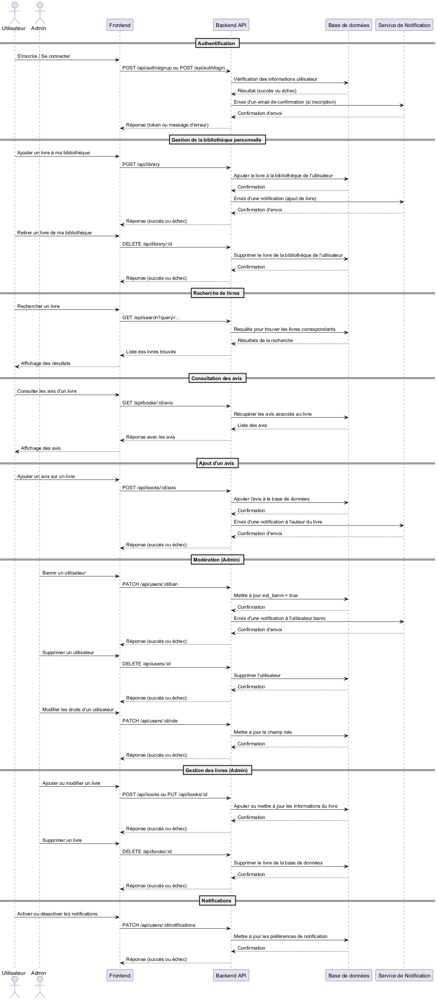
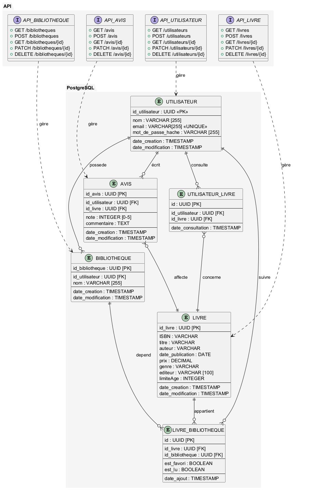

<link rel="stylesheet" href="styles.css">

<div style="overflow: auto; max-width: 100%; box-sizing: border-box; font-size: 1.4em; ">
    <h1 style="font-size: 2.5em; color: #333;">Blablabooks</h1>
</div>
<div style="border: 1px solid #ddd; padding: 15px; border-radius: 5px; background-color: #f9f9f9; overflow: auto; max-width: 100%; box-sizing: border-box;">

## Cahier des charges

---
<br>

### Présentation du projet

<br>
<br>

<div style="border: 1px solid #ddd; padding: 15px; border-radius: 5px; background-color:rgb(229, 229, 229); overflow: auto; max-width: 100%; box-sizing: border-box;">

<div style="border: 1px solid #ddd; padding: 15px; border-radius: 5px; background-color:rgb(255, 255, 255); overflow: auto; max-width: 100%; box-sizing: border-box;">

Dans le cadre de notre formation, nous allons développer une plateforme en ligne de gestion de bibliothèque personnelle, pensée pour répondre aux besoins des lecteurs de tous niveaux. Ce projet, baptisé **BlaBlaBook**, est porté par une association fictive de passionnés de lecture. Leur ambition ? Créer un véritable espace communautaire autour des livres, où chacun peut organiser sa propre bibliothèque, découvrir de nouvelles œuvres et partager ses avis avec d’autres lecteurs.

La plateforme s’adresse à un large public :

- **Lecteurs aguerris** cherchant à suivre leurs lectures et enrichir leur collection.
- **Lecteurs novices** désireux de trouver des recommandations personnalisées ou de commencer leur parcours littéraire.

Le développement du projet sera réalisé en équipe, sous la coordination de l’équipe pédagogique, selon une méthodologie agile. Le projet sera articulé en **trois sprints répartis sur trois semaines**, comprenant les phases suivantes : conception, développement, déploiement, tests et recettage.

Ce projet est une occasion concrète de mettre en pratique nos compétences techniques tout en répondant à un besoin réel et inspirant : **partager le plaisir de lire, ensemble**.
</div>

---

### Cible du projet (Personas)

<br>
<div style="border: 1px solid #ddd; padding: 15px; border-radius: 5px; background-color:rgb(255, 255, 255); overflow: auto; max-width: 100%; box-sizing: border-box;">

#### Persona 1 – Léa, l’étudiante passionnée

- **Âge** : 21 ans.
- **Profession** : Étudiante en lettres modernes.
- **Objectifs** : Trouver des ouvrages rapidement et à bon prix pour ses cours ou lectures personnelles.
- **Comportements** :
    - Préfère les versions numériques pour les annotations rapides.
    - A un budget limité, cherche des promotions ou livres d’occasion.
    - Utilise souvent les filtres de recherche (thème, auteur, période littéraire).
- **Attentes** :
    - Interface claire, accessible et rapide.
    - Livraison rapide et réductions étudiantes.
    - Suggestions personnalisées.

#### Persona 2 – Marc, le parent organisateur

- **Âge** : 38 ans.
- **Profession** : Cadre en télétravail, père de deux enfants.
- **Objectifs** : Acheter des livres pour ses enfants et parfois pour lui.
- **Comportements** :
    - Consulte le site sur mobile pendant les pauses.
    - Apprécie les guides d’achat ou sélections thématiques.
    - Aime regrouper ses achats et gérer une wishlist familiale.
- **Attentes** :
    - Navigation fluide sur mobile.
    - Classement clair par tranche d’âge ou catégories.
    - Possibilité de créer plusieurs listes d’envies.

#### Persona 3 – Claire, la lectrice érudite

- **Âge** : 57 ans.
- **Profession** : Professeure de philosophie au lycée.
- **Objectifs** : Chercher des éditions précises, annotées, souvent rares ou spécialisées.
- **Comportements** :
    - Passe du temps à comparer les éditions.
    - Aime lire les avis d’autres lecteurs.
    - Achète régulièrement, en précommande ou en import.
- **Attentes** :
    - Fiches détaillées avec infos sur traductions, éditions, préfaces.
    - Moteur de recherche et filtres puissants.
    - Système de fidélité et newsletter de nouveautés intellectuelles.

</div>

---

### Définition des besoins et objectifs
<br>
<div style="border: 1px solid #ddd; padding: 15px; border-radius: 5px; background-color:rgb(255, 255, 255); overflow: auto; max-width: 100%; box-sizing: border-box;">

#### Problèmes auxquels répond le projet :

- S’informer des nouvelles sorties de livres.
- Partager ses favoris, avis et achats.
- Trier les livres lus et à lire.
- Filtrer les livres par :
    - Date de publication.
    - Auteur.
    - Thèmes.
    - Prix.

#### Objectifs (solutions apportées) :

- Offrir une plateforme intuitive pour gérer sa bibliothèque personnelle.
- Proposer des recommandations personnalisées.
- Créer un espace communautaire autour de la lecture.

</div>

---

### Fonctionnalités du projet
<br>
<div style="border: 1px solid #ddd; padding: 15px; border-radius: 5px; background-color:rgb(255, 255, 255); overflow: auto; max-width: 100%; box-sizing: border-box;">

#### Fonctionnalités principales :

- **Page d'accueil** : Présentation de BlaBlaBook et affichage de 15 livres aléatoires.
- **Système d'inscription, de connexion, de modification, et de suppression de compte**.
- **Afficher les livres déjà consultés**.
- **Collection de livres personalisée**. Créer, modifier, supprimmer une bibliotheque.
- **Gestion de bibliothèque personnelle** : Ajouter, retirer, consulter les livres.
- **Recherche de livres** : Moteur de recherche.
- **Découverte de nouveaux livres** : Moteur de recherche.
- **Page de détail d'un livre** : Informations détaillées sur un livre.

#### Minimum Viable Product (MVP) :

- Système d'inscription et de connexion.
- Page d'accueil avec présentation de BlaBlaBook et affichage de livres aléatoires.
- Création de rubriques : Catalogue, Thème, Nouveautés, Top 15.

#### Évolutions potentielles :

- Création d’une liste de favoris.
- Recherche avancée de livres.
- signaler un contenu innaproprié.
- Menu déroulant plus complet.
- Ajout d’avis sur les livres.
- Partage sur les réseaux sociaux.
- Suivre les actualités des auteurs.

---

</div>

### Technologies utilisées
<br>
<div style="border: 1px solid #ddd; padding: 15px; border-radius: 5px; background-color:rgb(255, 255, 255); overflow: auto; max-width: 100%; box-sizing: border-box;">

#### Sécurisation :

- **Joi** : Sécuriser les entrées utilisateur.
- **Sanitize** : Prévenir les attaques par injection ou scripts.
- **Helmet** : Configurer correctement les en-têtes HTTP.

#### Backend :

- **PostgreSQL** : Base de données relationnelle robuste.
- **Node.js** : Environnement performant et scalable pour développer rapidement des API REST.

#### Frontend :

- **React.js** : Création d’interfaces utilisateur réactives et modulaires.
- **Docker** : Conteneurisation pour une configuration cohérente entre les environnements, simplifiant le déploiement et augmentant la scalabilité.

</div>

---

### Navigateurs compatibles
<br>
<div style="border: 1px solid #ddd; padding: 15px; border-radius: 5px; background-color:rgb(255, 255, 255); overflow: auto; max-width: 100%; box-sizing: border-box;">

- Chrome.
- Firefox.
- Safari.
- Edge.

</div>

---

### Arborescence de l'application

<br>
<div style="border: 1px solid #ddd; padding: 15px; border-radius: 5px; background-color:rgb(255, 255, 255); overflow: auto; max-width: 100%; box-sizing: border-box;">


```
Arborescence de l'application :

/
├── login (Page de connexion)
├── signup (Page d'inscription)
├── library (Bibliothèque personnelle)
├── book/:id (Détail d'un livre)
├── search (Recherche de livres)
├── favorites (Liste des favoris)
└── profile (Profil utilisateur)
```

</div>

---

### Routes prévues

<br>
<div style="border: 1px solid #ddd; padding: 15px; border-radius: 5px; background-color:rgb(255, 255, 255); overflow: auto; max-width: 100%; box-sizing: border-box;">

#### Authentification

- `POST /api/auth/signup` : Inscription d'un utilisateur.
- `POST /api/auth/login` : Connexion d'un utilisateur.
- `POST /api/auth/logout` : Déconnexion d'un utilisateur.

#### Gestion des utilisateurs

- `GET /api/users` : Récupérer la liste de tous les utilisateurs (Admin uniquement).
- `GET /api/users/:id` : Récupérer les informations d'un utilisateur spécifique.
- `PATCH /api/users/:id` : Mettre à jour les informations d'un utilisateur (nom, email, mot de passe).
- `DELETE /api/users/:id` : Supprimer un utilisateur (son propre compte ou via un accès Admin).

#### Gestion des livres

- `GET /api/books` : Récupérer la liste de tous les livres disponibles.
- `GET /api/books/:idBook` : Récupérer les détails d'un livre spécifique.
- `POST /api/books` : Ajouter un nouveau livre à la base de données (Admin uniquement).
- `PATCH /api/books/:idBook` : Modifier les informations d'un livre existant (Admin uniquement).
- `DELETE /api/books/:idBook` : Supprimer un livre de la base de données (Admin uniquement).

#### Bibliothèque personnelle

- `GET /api/library` : Récupérer toutes les bibliothèques personnelles (Admin uniquement).
- `GET /api/library/:idBibliotheque` : Récupérer les détails d'une bibliothèque personnelle spécifique.
- `POST /api/library` : Créer une nouvelle bibliothèque personnelle.
- `PATCH /api/library/:idBibliotheque` : Modifier les informations d'une bibliothèque personnelle.
- `DELETE /api/library/:idBibliotheque` : Supprimer une bibliothèque personnelle.

#### Favoris

- `GET /api/favorites` : Récupérer la liste des livres ajoutés aux favoris par un utilisateur.
- `POST /api/favorites` : Ajouter un livre à la liste des favoris.
- `DELETE /api/favorites/:idFavorite` : Retirer un livre de la liste des favoris.

#### Recherche

- `GET /api/search` : Rechercher des livres par titre, auteur ou thème.

</div>

---

### User Stories

<br>
<div style="border: 1px solid #ddd; padding: 15px; border-radius: 5px; background-color:rgb(255, 255, 255); overflow: auto; max-width: 100%; box-sizing: border-box;">
<br>

### En tant que : **Visiteur**

| **id** | **Je veux**                                | **Afin de**                                                                  | **Priorité** | **Sprint** |
|--------|--------------------------------------------|------------------------------------------------------------------------------|--------------|------------|
| 1      | M'inscrire sur la plateforme               | Accéder à toutes les fonctionnalités disponibles pour les utilisateurs       | Haute        | Sprint 1   |
| 2      | Me connecter à la plateforme               | Accéder à mes données personnelles et gérer ma bibliothèque                  | Haute        | Sprint 1   |
| 3      | Recevoir des suggestions de livres populaires | Découvrir des ouvrages intéressants sans avoir à chercher activement         | Moyenne      | Sprint 3   |
| 4      | Voir 15 livres au hasard                   | Découvrir des ouvrages intéressants sans avoir à chercher activement         | Moyenne      | Sprint 3   |
| 5      | Consulter les détails d'un livre           | Obtenir des informations sur un ouvrage avant de m'inscrire                  | Moyenne      | Sprint 2   |
| 6      | Voir les avis des autres utilisateurs sur un livre | Me faire une idée avant de m'inscrire ou d'acheter un ouvrage               | Moyenne      | Sprint 2   |
| 7      | Consulter les nouveautés disponibles       | Être informé des opportunités intéressantes sans avoir besoin de m'inscrire  | Moyenne      | Sprint 3   |
| 8      | Rechercher des livres par titre            | Trouver des ouvrages qui m'intéressent sans avoir besoin de m'inscrire       | Moyenne      | Sprint 2   |
| 9      | Rechercher des livres par auteur           | Trouver des ouvrages qui m'intéressent sans avoir besoin de m'inscrire       | Moyenne      | Sprint 2   |
| 10     | Rechercher des livres par genre            | Trouver des ouvrages qui m'intéressent sans avoir besoin de m'inscrire       | Moyenne      | Sprint 2   |


<br>

### En tant que : **Utilisateur**

| **id** | **Je veux**                                | **Afin de**                                                                  | **Priorité** | **Sprint** |
|--------|--------------------------------------------|------------------------------------------------------------------------------|--------------|------------|
| 1      | Me déconnecter de la plateforme            | Accéder à mes données personnelles et gérer ma bibliothèque                  | Haute        | Sprint 1   |
| 2      | Recevoir des recommandations personnalisées | Découvrir de nouvelles œuvres adaptées à mes goûts                          | Moyenne      | Sprint 2   |
| 3      | Ajouter ou retirer des livres de ma bibliothèque personnelle | Garder une trace des livres que j'ai lus ou que je souhaite lire           | Haute        | Sprint 1   |
| 4      | Retirer des livres de ma bibliothèque personnelle | Garder une trace des livres que j'ai lus ou que je souhaite lire       | Haute        | Sprint 1   |
| 5      | Voir les livres les plus populaires ou les mieux notés | Découvrir des ouvrages recommandés par la communauté                       | Moyenne      | Sprint 2   |
| 6      | Voir les événements littéraires à venir (salons, dédicaces, etc.) | Participer à des activités en lien avec mes centres d'intérêt              | Basse        | Sprint 3   |
| 7      | (Partager) Publier mes avis sur les livres | Contribuer à la communauté et échanger avec d'autres lecteurs               | Basse        | Sprint 3   |
| 8      | Modifier mes avis sur les livres           | Contribuer à la communauté et échanger avec d'autres lecteurs               | Basse        | Sprint 3   |
| 9      | Supprimer mes avis sur les livres          | Contribuer à la communauté et échanger avec d'autres lecteurs               | Basse        | Sprint 3   |
| 10     | Voir les avis des autres utilisateurs sur un livre | Me faire une idée avant d'acheter ou de lire un ouvrage                   | Moyenne      | Sprint 2   |
| 11     | Signaler un contenu inapproprié ou erroné  | Contribuer à la qualité et à la pertinence des informations sur la plateforme | Basse        | Sprint 3   |
| 12     | Créer une liste de favoris                 | Retrouver facilement les livres que j'aime ou que je souhaite lire plus tard | Moyenne      | Sprint 3   |
| 13     | Modifier une liste de favoris              | Retrouver facilement les livres que j'aime ou que je souhaite lire plus tard | Moyenne      | Sprint 3   |
| 14     | Supprimer une liste de favoris             | Retrouver facilement les livres que j'aime ou que je souhaite lire plus tard | Moyenne      | Sprint 3   |
| 15     | Ajouter des tags personnalisés à mes livres | Organiser mes livres selon mes propres critères                             | Moyenne      | Sprint 3   |
| 16     | Modifier des tags personnalisés à mes livres | Organiser mes livres selon mes propres critères                            | Moyenne      | Sprint 3   |
| 17     | Supprimer des tags personnalisés à mes livres | Organiser mes livres selon mes propres critères                            | Moyenne      | Sprint 3   |
| 18     | Exporter ma bibliothèque personnelle en format PDF ou Excel | Conserver une copie de mes livres pour consultation hors ligne             | Basse        | Sprint 3   |
| 19     | Ajouter des livres à ma bibliothèque via un scan de code-barres | Simplifier l'ajout de nouveaux ouvrages                                    | Moyenne      | Sprint 3   |
| 20     | Accéder à des statistiques sur mes habitudes de lecture | Visualiser mes progrès et mes préférences littéraires                      | Moyenne      | Sprint 3   |
| 21     | Voir un historique de mes lectures         | Suivre mon parcours littéraire et me remémorer mes lectures passées         | Moyenne      | Sprint 3   |
| 22     | Recevoir des suggestions basées sur mes lectures passées | Découvrir des livres similaires à ceux que j'ai appréciés                  | Moyenne      | Sprint 2   |
| 23     | Suivre mes lectures et enrichir ma collection | Organiser ma bibliothèque personnelle et retrouver facilement mes livres préférés | Haute        | Sprint 1   |
| 24     | Voir toutes mes bibliothèques              | Accéder à l'ensemble de mes collections de livres organisées                | Moyenne      | Sprint 3   |
| 25     | Modifier un élément de mon profil (nom, email, mot de passe) | Mettre à jour mes informations personnelles pour qu'elles soient correctes | Moyenne      | Sprint 2   |
| 26     | Supprimer mon compte                       | Effacer toutes mes données personnelles de la plateforme                    | Haute        | Sprint 2   |


<br>

### En tant que : **Admin**

| **id** | **Je veux**                                | **Afin de**                                                                 | **Priorité** | **Sprint** |
|--------|--------------------------------------------|------------------------------------------------------------------------------|--------------|------------|
| 1      | Gérer les livres (ajouter)                 | Maintenir une bibliothèque                                                   | Haute        | Sprint 1   |
| 2      | Gérer les livres (modifier)                | Maintenir une bibliothèque                                                   | Haute        | Sprint 1   |
| 3      | Gérer les livres (supprimer)               | Maintenir une bibliothèque                                                   | Haute        | Sprint 1   |
| 4      | Retirer des livres de ma bibliothèque personnelle | Supprimer les ouvrages que je ne souhaite plus suivre                      | Haute        | Sprint 1   |
| 5      | Gérer les utilisateurs (bannir)            | Garantir un environnement sûr et ajuster les permissions                     | Haute        | Sprint 1   |
| 6      | Gérer les utilisateurs (modifier les droits) | Garantir un environnement sûr et ajuster les permissions                    | Haute        | Sprint 1   |
| 7      | Traiter les signalements                   | Répondre aux problèmes signalés par les utilisateurs                         | Haute        | Sprint 1   |
| 8      | Modérer les avis sur les ouvrages          | Assurer la qualité et la pertinence des commentaires                         | Haute        | Sprint 1   |
| 9      | Accéder aux statistiques (utilisateurs actifs, livres consultés, avis) | Identifier les tendances et évaluer la qualité des interactions           | Moyenne      | Sprint 3   |

</div>

### Analyse des risques

<br>
<div style="border: 1px solid #ddd; padding: 15px; border-radius: 5px; background-color:rgb(255, 255, 255); overflow: auto; max-width: 100%; box-sizing: border-box;">

#### Faille XSS (Cross-Site Scripting)

- **Impact potentiel** :
    - Vol de cookies ou de données sensibles.
    - Redirection vers des sites malveillants.
    - Dégradation de l'expérience utilisateur.

- **Mesures préventives** :
    - Valider et échapper toutes les entrées utilisateur.
    - Utiliser des bibliothèques comme `DOMPurify` pour nettoyer les données HTML.
    - Configurer des en-têtes HTTP comme `Content-Security-Policy` pour limiter les scripts exécutables.

---

#### Faille CSRF (Cross-Site Request Forgery)

- **Impact potentiel** :
    - Modification de données sensibles.
    - Exécution d'actions non désirées au nom de l'utilisateur.

- **Mesures préventives** :
    - Implémenter des jetons CSRF (anti-CSRF tokens) pour valider les requêtes.
    - Vérifier l'origine des requêtes via les en-têtes `Origin` ou `Referer`.
    - Restreindre les méthodes HTTP sensibles (comme POST, PUT, DELETE) aux utilisateurs authentifiés.

---

#### Faille SQLi (Injection SQL)


- **Impact potentiel** :
    - Accès non autorisé aux données sensibles.
    - Modification ou suppression de données.
    - Compromission complète de la base de données.

- **Mesures préventives** :
    - Utiliser des requêtes préparées (paramétrées) pour interagir avec la base de données.
    - Valider et échapper toutes les entrées utilisateur.
    - Restreindre les permissions de la base de données pour limiter les actions possibles en cas de compromission.

</div>

---

### Rôles de chacun

<br>
<div style="display: flex; flex-direction: column; align-items: center; border: 1px solid #ddd; padding: 15px; border-radius: 5px; background-color:rgb(255, 255, 255); overflow: auto; max-width: 100%; box-sizing: border-box;">

#### Répartition des tâches et responsabilités au sein de l’équipe

<div>

| **Nom**      | **Rôle**                     | **Responsabilités principales**                                                                 |
|--------------|------------------------------|------------------------------------------------------------------------------------------------|
| Mickaël      | ... | ... |
| Jérémy       | ... | ... |
| Pierre       | ... | ... |
| Samuel       | ... | ... |

</div>
</div>

#### CLI Commands pour les rôles

```bash
# Samuel - Chef de projet
git checkout -b feature/project-coordination
# Ajout des tâches dans le backlog
npm run add-task -- "Sprint Planning"

# Pierre - Développeur Backend
git checkout -b feature/backend-api
# Lancer le serveur backend
npm run start:backend

# Jérémy - Développeur Frontend
git checkout -b feature/frontend-ui
# Lancer le serveur frontend
npm run start:frontend

#  Mickaël - Analyste QA
git checkout -b feature/qa-testing
# Lancer les tests automatisés
npm run test
```

</div>

### Documents de conception

<br>

<!-- ```js  
// @startuml
// entity "UTILISATEUR" {
//     * id_utilisateur
//     --
//     nom
//     email
//     mot_de_passe
// }

// entity "BIBLIOTHEQUE" {
//     * id_bibliotheque
//     --
//     nom
//     description
// }

// entity "FAVORI" {
//     * id_favori
//     --
//     date_ajout
// }

// entity "AVIS" {
//     * id_avis
//     --
//     note
//     commentaire
//     date
// }

// entity "LIVRE" {
//     * id_livre
//     --
//     titre
//     auteur
//     date_publication
//     prix
// }

// UTILISATEUR }o--|| BIBLIOTHEQUE : possède_bibliothèque
// UTILISATEUR }o--|| FAVORI : ajoute_favori
// UTILISATEUR }o--|| AVIS : écrit_avis
// BIBLIOTHEQUE }o--|| LIVRE : contient
// FAVORI }o--|| LIVRE : favori_concerne
// AVIS }o--|| LIVRE : avis_concerne
// @enduml
``` -->

<br>
<div style="display: flex; flex-direction: row; justify-content: space-around; align-items: center; border: 1px solid #ddd; padding: 15px; border-radius: 5px; background-color:rgb(255, 255, 255); overflow: auto; max-width: 100%; box-sizing: border-box;">


</div>

---

### **Diagramme de séquence** :

<br>



### Use Cases : Scénarios complets décrivant les interactions utilisateur-système

<br>

| **ID** | **Titre du Use Case**                     | **Acteurs**               | **Description**                                                                                     | **Préconditions**                                                                 | **Scénario principal**                                                                                                     | **Extensions**                                                                                     |
|--------|-------------------------------------------|---------------------------|-----------------------------------------------------------------------------------------------------|-----------------------------------------------------------------------------------|---------------------------------------------------------------------------------------------------------------------------|-----------------------------------------------------------------------------------------------------|
| UC01   | Inscription d'un utilisateur              | Visiteur                  | Permet à un visiteur de s'inscrire sur la plateforme pour accéder aux fonctionnalités utilisateur. | Le visiteur doit fournir une adresse email valide et un mot de passe.             | 1. Le visiteur accède à la page d'inscription. <br> 2. Il remplit le formulaire. <br> 3. Le système valide les données et crée un compte. | 1a. Email déjà utilisé : Afficher un message d'erreur. <br> 1b. Mot de passe faible : Demander un mot de passe plus sécurisé. |
| UC02   | Connexion d'un utilisateur                | Utilisateur               | Permet à un utilisateur de se connecter pour accéder à son compte.                                | L'utilisateur doit être inscrit et disposer de ses identifiants.                 | 1. L'utilisateur accède à la page de connexion. <br> 2. Il entre ses identifiants. <br> 3. Le système vérifie et connecte l'utilisateur. | 2a. Identifiants incorrects : Afficher un message d'erreur.                                          |
| UC03   | Recherche de livres                      | Visiteur, Utilisateur     | Permet de rechercher des livres par titre, auteur ou thème.                                        | Aucun.                                                                            | 1. L'utilisateur accède à la barre de recherche. <br> 2. Il entre un mot-clé. <br> 3. Le système affiche les résultats correspondants. | 3a. Aucun résultat : Afficher un message indiquant qu'aucun livre ne correspond à la recherche.     |
| UC04   | Gestion de la bibliothèque personnelle    | Utilisateur               | Permet à un utilisateur d'ajouter ou retirer des livres de sa bibliothèque personnelle.            | L'utilisateur doit être connecté.                                                | 1. L'utilisateur accède à sa bibliothèque. <br> 2. Il ajoute ou retire un livre. <br> 3. Le système met à jour la bibliothèque. | 2a. Livre déjà présent : Afficher un message d'information.                                         |
| UC05   | Consultation des détails d'un livre       | Visiteur, Utilisateur     | Permet de consulter les informations détaillées d'un livre.                                        | Aucun.                                                                            | 1. L'utilisateur clique sur un livre. <br> 2. Le système affiche les détails du livre.                                      | Aucun.                                                                                              |
| UC06   | Ajout d'un livre aux favoris              | Utilisateur               | Permet à un utilisateur d'ajouter un livre à sa liste de favoris.                                 | L'utilisateur doit être connecté.                                                | 1. L'utilisateur clique sur l'option "Ajouter aux favoris". <br> 2. Le système ajoute le livre à la liste de favoris.       | 1a. Livre déjà dans les favoris : Afficher un message d'information.                                |
| UC07   | Publication d'un avis sur un livre        | Utilisateur               | Permet à un utilisateur de publier un avis sur un livre.                                           | L'utilisateur doit être connecté.                                                | 1. L'utilisateur accède à la page d'un livre. <br> 2. Il rédige un avis. <br> 3. Le système enregistre l'avis.               | 2a. Avis non conforme : Afficher un message d'erreur et demander une modification.                   |
| UC08   | Gestion des utilisateurs (Admin)          | Admin                     | Permet à un administrateur de gérer les utilisateurs (bannir, modifier les droits).                | L'administrateur doit être connecté.                                             | 1. L'admin accède à la liste des utilisateurs. <br> 2. Il sélectionne un utilisateur. <br> 3. Le système applique les modifications. | Aucun.                                                                                              |
| UC09   | Ajout d'un livre à la base de données     | Admin                     | Permet à un administrateur d'ajouter un nouveau livre à la base de données.                       | L'administrateur doit être connecté.                                             | 1. L'admin accède à la page d'ajout de livre. <br> 2. Il remplit le formulaire. <br> 3. Le système enregistre le livre.       | 2a. Données incomplètes : Afficher un message d'erreur.                                             |
| UC10   | Consultation des statistiques             | Admin                     | Permet à un administrateur de consulter les statistiques d'utilisation de la plateforme.           | L'administrateur doit être connecté.                                             | 1. L'admin accède à la page des statistiques. <br> 2. Le système affiche les données pertinentes.                            | Aucun.                                                                                              |

### **Dictionnaire de données** : Liste des entités et de leurs attributs.

<br>



---

### Éléments graphiques

### Wireframes

Les wireframes sont des schémas simplifiés représentant la structure des pages de l'application. Ils permettent de visualiser l'organisation des éléments avant de passer à la conception graphique.

- **Page d'accueil** : Présentation de BlaBlaBook, barre de recherche, et affichage de livres populaires.
- **Page de connexion** : Formulaire simple avec champs pour l'email et le mot de passe.
- **Page de bibliothèque personnelle** : Liste des livres ajoutés par l'utilisateur, avec options pour les trier ou les retirer.
- **Page de détail d'un livre** : Informations détaillées sur un livre, avec bouton pour l'ajouter à la bibliothèque ou aux favoris.

### Maquettes

Les maquettes sont des représentations visuelles détaillées des pages, intégrant les couleurs, typographies, et éléments graphiques définis dans la charte graphique.

- **Logiciel utilisé** : Figma ou Adobe XD.
- **Exemples de pages** :
    - Page d'accueil : Mise en avant des recommandations et des nouveautés.
    - Page de recherche : Résultats affichés sous forme de grille ou de liste.
    - Page de profil utilisateur : Informations personnelles et paramètres.

### Charte graphique

La charte graphique définit l'identité visuelle de BlaBlaBook. Elle garantit une cohérence esthétique sur l'ensemble de l'application.

- **Palette de couleurs** :
    - Couleur principale : #333 (gris foncé).
    - Couleur secondaire : #f9f9f9 (gris clair).
    - Couleur d'accentuation : #007BFF (bleu).

- **Typographie** :
    - Police principale : Roboto (sans-serif).
    - Police secondaire : Merriweather (serif) pour les titres.

- **Icônes** :
    - Utilisation de la bibliothèque FontAwesome pour les icônes (ex. : recherche, favoris, profil).

- **Logotype** :
    - Un logo minimaliste représentant un livre ouvert, avec le nom "BlaBlaBook" en typographie moderne.

Ces éléments serviront de base pour la conception et le développement de l'application.

</div>